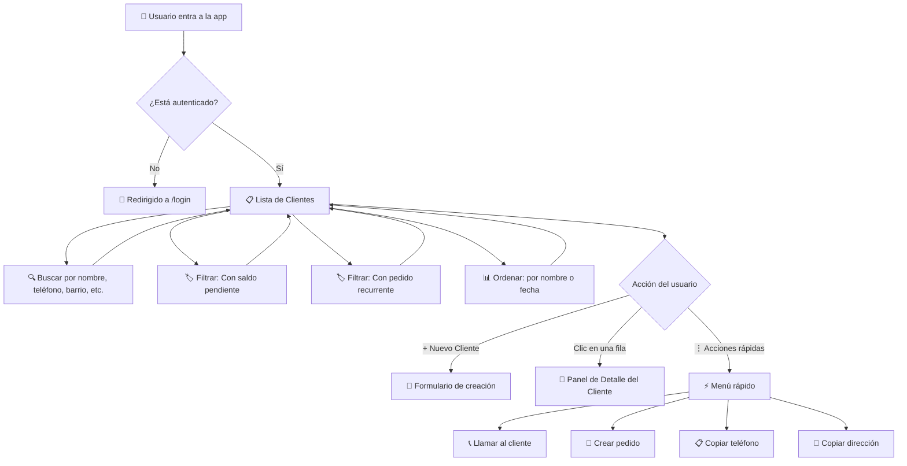
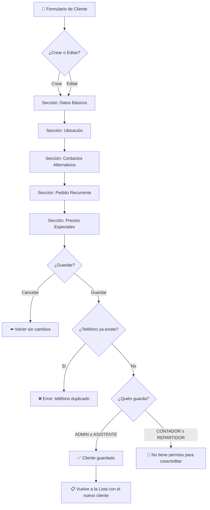
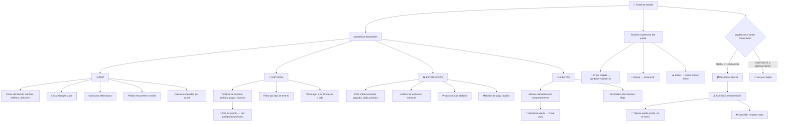
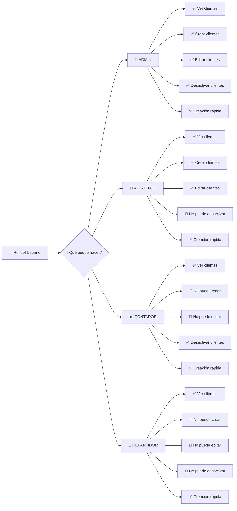

# Diagrama de Flujo — Módulo Clientes

> **Propósito**: Mapa visual de qué puede hacer cada usuario en el módulo de Clientes, qué botones ve, a dónde lo llevan los links y qué restricciones existen.

---

## 1. Flujo Principal de Navegación



---

## 2. Creación y Edición de Clientes



---

## 3. Panel de Detalle del Cliente



---

## 4. Mapa de Permisos por Rol



---

## 5. Redirecciones y Navegación Cruzada

```mermaid
flowchart TD
    A[📄 Panel de Detalle] --> B{¿A dónde lleva cada link?}

    B --> C[🛒 Crear Pedido]
    C --> C1[/pedidos?cliente=ID]
    C1 --> C2[Formulario de pedido con cliente preseleccionado]

    B --> D[🔄 Ver Plantilla Recurrente]
    D --> D1[/recurrentes/ID]
    D1 --> D2[Gestión de pedidos automáticos]

    B --> E[📋 Ver Pedido en Historial]
    E --> E1[/pedidos?openPedido=ID]
    E1 --> E2[Panel de detalle del pedido]

    B --> F[📄 Ver Factura en Historial]
    F --> F1[/facturas?openFactura=ID]
    F2[Panel de detalle de la factura]

    B --> G[🎫 Ver Caso en Historial]
    G --> G1[/casos]
    G1 --> G2[Lista de casos de soporte]

    B --> H[❌ Cerrar Panel]
    H --> H1[⬅️ Volver a Lista de Clientes]
```

---

## 6. Reglas de Negocio y Restricciones

| Regla | Qué pasa |
|-------|----------|
| **Teléfono único** | No se puede crear un cliente si ya existe otro con el mismo teléfono (activo o en contactos alternativos) |
| **Cliente inactivo** | No aparece en la lista, no se puede editar ni crearle pedidos |
| **Soft delete** | Al "eliminar" un cliente, solo se oculta. Los datos se conservan para historial |
| **Precios especiales** | Solo se guardan si son diferentes al precio base. Se configuran por canal (Domicilio / Punto de venta) |
| **Horario preferido** | Formato HH:mm. Es opcional |
| **Notas del cliente** | Máximo 500 caracteres |
| **Teléfono válido** | Debe ser formato colombiano: celular 3xx (10 dígitos) o fijo 60x (10-11 dígitos) |
| **Link de Maps** | Debe ser una URL válida. Es opcional |
| **Contactos alternativos** | Deben tener nombre y teléfono. Se pueden agregar varios |
| **Historial limitado** | El resumen de facturas máximo muestra 3 meses |

---

## 7. Resumen Visual de Botones por Pantalla

### Lista de Clientes (`/clientes`)

| Elemento | Tipo | Acción |
|----------|------|--------|
| `+ Nuevo Cliente` | Botón azul (header) | Abre modal de creación |
| `Buscar` | Input con lupa | Filtra por nombre, teléfono, barrio, negocio |
| `Con saldo` | Toggle pill | Muestra solo clientes con deuda |
| `Con frecuencia` | Toggle pill | Muestra solo con pedido recurrente |
| `Ordenar por Nombre` | Columna clickeable | Orden A→Z o Z→A |
| `Ordenar por Fecha` | Columna clickeable | Orden antiguo→reciente o viceversa |
| `⋮` (tres puntos por fila) | Menú desplegable | Llamar, crear pedido, copiar teléfono, copiar dirección |

### Panel de Detalle (side panel)

| Elemento | Tipo | Acción |
|----------|------|--------|
| `Crear Pedido` | Link azul | Va a `/pedidos` con cliente preseleccionado |
| `Llamar` | Link verde | Abre marcador telefónico |
| `Editar` | Botón gris | Activa modo edición inline |
| `Desactivar` | Botón rojo (solo ADMIN/CONTADOR) | Oculta el cliente tras confirmación |
| `Info / Historial / Stats / Alertas` | Pestañas | Cambia el contenido del panel |
| `X` (cerrar) | Botón | Cierra el panel, vuelve a la lista |

### Modal de Crear/Editar

| Elemento | Tipo | Acción |
|----------|------|--------|
| `Básico / Ubicación / Contactos / Recurrentes / Precios` | Pestañas internas | Navega entre secciones del formulario |
| `Cancelar` | Botón | Cierra el modal sin guardar |
| `Crear cliente` / `Guardar` | Botón azul | Valida y guarda los datos |
| `+ Agregar contacto` | Botón | Añade un contacto alternativo |
| `🗑️ Eliminar contacto` | Botón | Quita un contacto alternativo |
