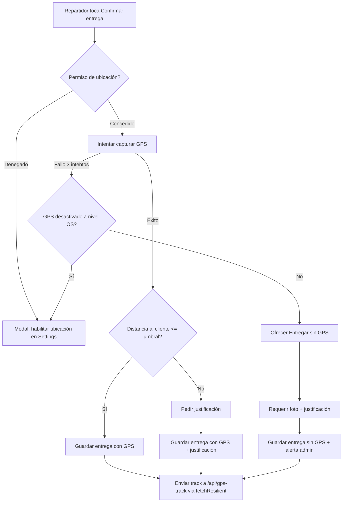
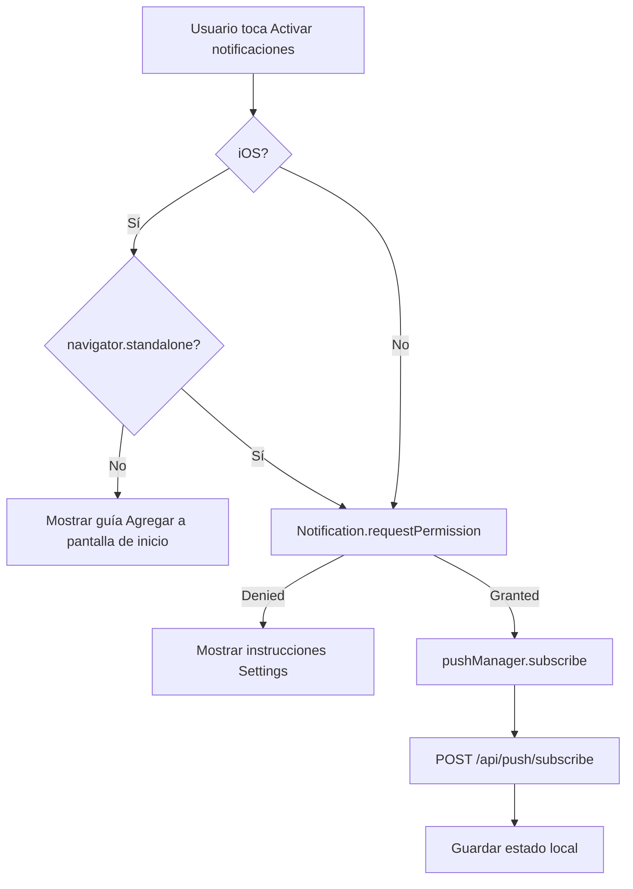

# Spec: PWA completa — geolocalización, notificaciones push e instalación

**Fecha:** 2026-06-17  
**Estado:** Aprobado para implementación  
**Autor:** Asistente de código  
**Stack:** Next.js 16.2.4, React 19.2.4, Serwist 9.5.11 (`@serwist/turbopack`), Auth.js v5, Prisma 6.19.3, PostgreSQL, Dexie 4.4.2

---

## 1. Contexto y objetivos

Agua Bambú es un ERP para planta de agua embotellada con 6 usuarios concurrentes en zonas rurales con conectividad 2G/3G. La app ya es una PWA parcial: tiene manifest, service worker con Serwist, offline-first con Dexie y backend de push preparado. Sin embargo, faltan piezas para que sea una PWA completa y robusta:

1. **Geolocalización:** el repartidor debe registrar el punto exacto de cada entrega para auditoría.
2. **Notificaciones push:** opt-in por rol, para alertas de asignaciones y casos urgentes.
3. **Instalación PWA:** flujo guiado para Android (`beforeinstallprompt`) e iOS (instrucciones manuales).
4. **Correcciones bloqueantes:** headers que hoy impiden GPS/cámara, manifest incompleto, assets faltantes.

### Objetivos de negocio

- Toda entrega del repartidor debe dejar evidencia de ubicación (GPS) o una justificación validable.
- El admin puede supervisar entregas fuera de rango y corregir excepciones.
- Los usuarios reciben notificaciones relevantes según su rol (opt-in).
- La app se puede instalar en Android y iOS como PWA.

### Objetivos técnicos

- No romper la arquitectura offline-first existente.
- Reutilizar `fetchResilient` y `requestQueue` para GPS en lugar de crear colas paralelas.
- No migrar a nativo en este ciclo; mantener PWA pura.

---

## 2. Limitaciones técnicas que aceptamos

Estas limitaciones son inherentes a una **PWA pura** y no se pueden resolver sin migrar a Capacitor/TWA o nativo:

| Limitación | Impacto | Mitigación en este diseño |
|------------|---------|---------------------------|
| No hay GPS en background con pantalla apagada. | No se rastrea la ruta del repartidor entre pedidos. | Se captura GPS one-shot al entregar, no tracking continuo. |
| En iOS, Web Push solo funciona si la PWA está en Home Screen. | Usuarios de iOS no reciben push si no instalan. | Se guía explícitamente a instalar antes de ofrecer push. |
| No se puede "forzar" al usuario a activar ubicación. | El navegador/OS controla el permiso. | Se bloquea el flujo de entrega y se guía a Settings. |
| No hay acceso nativo avanzado (BLE, cámara raw, etc.). | Funcionalidades nativas avanzadas no disponibles. | Se usa `<input capture="environment">` para fotos. |

> **Decisión estratégica:** mantener PWA pura en este ciclo. Evaluar Capacitor/TWA solo si en el futuro se requiere GPS en background o push en iOS sin instalación.

---

## 3. Alcance

### Dentro del alcance

1. Corrección de `Permissions-Policy` y `vercel.json`.
2. Completar manifest (`id`, `lang`, `dir`, `categories`, `screenshots`, `shortcuts`).
3. Crear assets faltantes: `badge-72x72.png`, `apple-touch-icon.png`.
4. Alinear `theme_color` del manifest con `themeColor` del viewport.
5. Desactivar `reloadOnOnline` en `SerwistProvider`.
6. Implementar captura GPS one-shot obligatoria para repartidor al entregar.
7. Crear API `POST /api/gps-track` y usar `fetchResilient` para offline.
8. Configuración del umbral de distancia (default 30m) y justificación sin GPS.
9. Flujo admin para marcar entregado sin GPS con nota.
10. Implementar suscripción push opt-in por rol.
11. Handler `pushsubscriptionchange` en el SW.
12. UI de instalación PWA para Android e iOS.
13. Safe areas CSS y mejoras mobile menores.
14. Tests unitarios y E2E.

### Fuera del alcance

1. Migración a Capacitor/TWA o nativo.
2. GPS en background / tracking de ruta continuo.
3. Notificaciones forzadas sin permiso del usuario.
4. Badging API de icono (soporte cross-browser inconsistente).
5. `display_override` o `window-controls-overlay` (son para desktop).
6. Imágenes de startup para iOS (Apple dejó de soportarlas en iOS 16+).

---

## 4. Arquitectura general

```
┌─────────────────────────────────────────────────────────────────────┐
│                            Cliente (PWA)                             │
│  ┌────────────────┐  ┌──────────────────┐  ┌──────────────────────┐ │
│  │ useGPSCapture  │  │ usePushSubscription│  │ usePWAInstall        │ │
│  │ (foreground)   │  │ (opt-in por rol)   │  │ (Android/iOS)        │ │
│  └───────┬────────┘  └────────┬─────────┘  └──────────┬───────────┘ │
│          │                    │                       │             │
│          ▼                    ▼                       ▼             │
│  ┌──────────────────────────────────────────────────────────────┐  │
│  │                     Dexie Offline Queue                       │  │
│  │  pedidos | clientes | syncQueue | requestQueue | failedItems │  │
│  └───────────────────────────┬──────────────────────────────────┘  │
│                              │                                       │
│                              ▼                                       │
│  ┌──────────────────────────────────────────────────────────────┐  │
│  │                      syncWithServer()                         │  │
│  │   replay requestQueue (GPS, pedidos, etc.)                   │  │
│  └───────────────────────────┬──────────────────────────────────┘  │
└──────────────────────────────┼──────────────────────────────────────┘
                               │
                               ▼
┌─────────────────────────────────────────────────────────────────────┐
│                              Servidor                                │
│  POST /api/gps-track        POST /api/push/subscribe                 │
│  broadcastPush / sendPushToUser    DELETE /api/push/unsubscribe      │
│  GpsTrack model               PushSubscription model                 │
└─────────────────────────────────────────────────────────────────────┘
```

---

## 5. Decisiones técnicas clave

| Decisión | Justificación | Fuente |
|----------|---------------|--------|
| **PWA pura, no Capacitor/TWA** | El requisito real es GPS one-shot y push opt-in; no se justifica la complejidad nativa para 6 usuarios. | Análisis de costo/beneficio del proyecto. |
| **`getCurrentPosition` one-shot** | Suficiente para evidencia de entrega. Ahorra batería y datos vs. `watchPosition`. | MDN Geolocation, W3C spec. |
| **Reutilizar `fetchResilient` para GPS** | Evita duplicar la cola offline ya probada con dedup, DLQ y backoff. | Código existente `src/lib/fetch-resilient.ts`. |
| **GPS obligatorio con bypass por justificación** | No se puede forzar al hardware, pero sí se puede bloquear el flujo y exigir una excepción auditada. | Patrón estándar en apps de logística. |
| **Push opt-in por gesto de usuario** | Apple y Chrome penalizan o bloquean autoprompts de notificación. | web.dev Permission UX, WebKit docs. |
| **iOS requiere instalación previa para push** | Web Push en iOS solo funciona en PWAs instaladas con `display: standalone`. | WebKit blog 16.4. |
| **`reloadOnOnline={false}`** | Evita que Serwist recargue y pierda estado no sincronizado. | SerwistProvider API (`@serwist/turbopack`). |
| **No `display_override`** | Es para desktop PWA; en mobile es inútil. | MDN `display_override`. |
| **No `apple-touch-startup-image`** | Apple dejó de soportarlo en iOS 16+. | Documentación de WebKit/iOS. |
| **Mantener `clientsClaim: false`** | Evita blank page en SSR streaming de Next.js. Trade-off aceptado. | Comentario documentado en `src/app/sw.ts`. |

---

## 6. Fases de implementación

### Fase 1 — Correcciones bloqueantes y base PWA

**Objetivo:** desbloquear GPS/cámara y completar la base PWA.

| # | Tarea | Archivos a modificar | Criterio de éxito |
|---|-------|----------------------|-------------------|
| 1.1 | Cambiar `Permissions-Policy` a `geolocation=(self)` | `next.config.ts`, `vercel.json` | Lighthouse no reporta bloqueo de geolocalización. |
| 1.2 | Corregir ruta del SW en `vercel.json` de `/sw.js` a `/serwist/sw.js` | `vercel.json` | Header `Service-Worker-Allowed` aplica a la ruta real. |
| 1.3 | Crear `badge-72x72.png` monocromático | `public/icons/` | El SW referencia un archivo existente. |
| 1.4 | Crear `apple-touch-icon.png` 180x180 | `public/icons/` | iOS muestra icono al agregar a Home Screen. |
| 1.5 | Completar manifest: `id`, `lang`, `dir`, `categories`, `screenshots`, `shortcuts` | `public/manifest.json` | PWABuilder/Lighthouse no reportan campos críticos faltantes. |
| 1.6 | Alinear `theme_color` manifest (`#0ea5e9`) con viewport (`#2563eb`) | `public/manifest.json`, `src/app/layout.tsx` | Un solo color de marca. |
| 1.7 | Pasar `reloadOnOnline={false}` a `SerwistProvider` | `src/app/layout.tsx` | No hay recarga automática al volver online. |
| 1.8 | Actualizar `AGENTS.md` sobre SW manual obsoleto | `AGENTS.md` | Documentación coincide con el código. |

### Fase 2 — Geolocalización para repartidor

**Objetivo:** evidencia de ubicación obligatoria en cada entrega, con bypass auditado.

#### 6.2.1 Modelo de datos

No se requieren cambios de schema. Se reutilizan:

- `Pedido.gpsLat`, `Pedido.gpsLng` (existentes).
- `Pedido.fotoEntrega` (existente).
- Nuevos campos opcionales en `Pedido`:
  - `gpsAccuracy?: Decimal @db.Decimal(10, 2)` — radio de error en metros.
  - `gpsJustificacion?: String @db.Text` — justificación si no hay GPS.
  - `entregadoConGps: Boolean @default(true)`.
  - `entregadoAt?: DateTime @db.Timestamptz()`.
  - `adminOverrideNota?: String @db.Text` — nota del admin si marca sin GPS.
  - `adminOverrideBy?: String` — userId del admin.
  - `adminOverrideAt?: DateTime @db.Timestamptz()`.

- `GpsTrack` ya existe (`prisma/schema.prisma:763`). Se usará para guardar el historial de tracks del repartidor.

#### 6.2.2 Nuevos archivos

| Archivo | Responsabilidad |
|---------|-----------------|
| `src/hooks/use-gps-capture.ts` | Captura GPS one-shot con Permissions API, reintentos, cache y manejo de errores. |
| `src/lib/gps.ts` | Helper `isWithinDeliveryRadius(lat, lng, clienteLat, clienteLng, radiusMeters)`. |
| `src/app/api/gps-track/route.ts` | `POST` para persistir un `GpsTrack`. Auth: REPARTIDOR/ADMIN. |
| `src/app/api/pedidos/[id]/entrega/route.ts` (modificar) | Validar GPS/justificación y guardar campos nuevos. |

#### 6.2.3 Configuración

Nueva fila en tabla `Configuracion` (o `.env` si es estático):

- `umbralGpsEntregaMetros`: number, default **30**.
- `requerirGpsParaEntrega`: boolean, default **true**.
- `permitirEntregaSinGpsConJustificacion`: boolean, default **true**.

#### 6.2.4 Flujo del repartidor

```
1. Toca "Confirmar entrega"
2. Verificar permiso de ubicación
   ├── Denegado → Modal bloqueante con instrucciones para ir a Settings
   └── Concedido → Intentar capturar GPS
3. Capturar GPS (máx. 3 intentos, timeout 8s, enableHighAccuracy: true)
   ├── ÉXITO
   │   ├── Calcular distancia a ubicación del cliente
   │   ├── ≤ umbral → Entrega OK
   │   └── > umbral → Pedir justificación + foto
   └── FALLO
       ├── GPS desactivado a nivel OS → Modal bloqueante
       └── Sin señal → Ofrecer "Entregar sin GPS" con justificación + foto obligatorias
4. Enviar foto + datos a POST /api/pedidos/[id]/entrega
5. Enviar track a POST /api/gps-track vía fetchResilient (offline-safe)
```

#### 6.2.5 Flujo admin

Desde el detalle del pedido o embarque, el admin puede:

- Ver un badge "Sin GPS" o "Fuera de rango".
- Revisar foto y justificación.
- Marcar como "entrega válida" o "entrega no válida" con nota.
- Si marca como entregada manualmente, se guarda `adminOverrideNota`, `adminOverrideBy`, `adminOverrideAt`.

### Fase 3 — Notificaciones push opt-in

**Objetivo:** suscribir usuarios a notificaciones push según su rol.

#### 6.3.1 Nuevos archivos

| Archivo | Responsabilidad |
|---------|-----------------|
| `src/lib/push-client.ts` | `urlBase64ToUint8Array(vapidPublicKey)`, helper de suscripción. |
| `src/hooks/use-push-subscription.ts` | Solicita permiso, suscribe con `pushManager`, envía al backend, desuscribe. |
| `src/components/push-permission-banner.tsx` | Banner opt-in en respuesta a gesto de usuario. |
| `src/components/push-settings.tsx` | Toggle en configuración para activar/desactivar notificaciones. |

#### 6.3.2 Modificaciones

| Archivo | Cambio |
|---------|--------|
| `src/app/sw.ts` | Agregar handler `pushsubscriptionchange` para re-suscribir. Validar payload mínimo en `push` handler. |
| `src/app/(app)/header.tsx` | Al logout: `pushManager.unsubscribe()` + `DELETE /api/push/unsubscribe`. |
| `src/app/(app)/sidebar.tsx` | Igual que header. |
| `src/app/(app)/configuracion/configuracion-client.tsx` | Agregar toggle de notificaciones. |

#### 6.3.3 Flujo de suscripción

```
1. Usuario toca "Activar notificaciones" (gesto explícito)
2. Detectar plataforma
   ├── iOS + no instalado → Mostrar guía "Agregar a pantalla de inicio"
   └── Android / iOS instalado → Continuar
3. Notification.requestPermission()
   ├── denied → Mostrar instrucciones para habilitar en Settings
   └── granted → Continuar
4. registration.pushManager.subscribe({ userVisibleOnly: true, applicationServerKey })
5. Enviar subscription a POST /api/push/subscribe
6. Guardar estado local (ej. localStorage o context)
```

#### 6.3.4 Notificaciones por rol

| Rol | Eventos que generan notificación |
|-----|----------------------------------|
| ADMIN | Caso antifraude ALTA, cierre de caja pendiente, embarque no enviado. |
| ASISTENTE | Nuevo pedido asignado, pedidos recurrentes por confirmar, cliente bloqueado. |
| REPARTIDOR | Embarque asignado, cambio en embarque, recordatorio de inicio de ruta. |
| CONTADOR | Cierre de día pendiente, inconsistencia en cierre, resumen diario listo. |

En el backend, antes de enviar, filtrar `PushSubscription` por `user.role`.

### Fase 4 — UX mobile/tablet e instalación

**Objetivo:** mejorar la experiencia en dispositivos móviles y guiar la instalación.

| # | Tarea | Archivos |
|---|-------|----------|
| 4.1 | Agregar clases de safe areas | `src/app/globals.css` |
| 4.2 | Aplicar `pt-safe` al header y `pb-safe` al drawer móvil | `src/app/(app)/header.tsx`, `src/app/(app)/sidebar.tsx` |
| 4.3 | Agregar `viewport-fit: 'cover'` | `src/app/layout.tsx` |
| 4.4 | Crear hook `usePWAInstall` | `src/hooks/use-pwa-install.ts` |
| 4.5 | Crear banner de instalación por plataforma | `src/components/pwa-install-banner.tsx` |
| 4.6 | Reemplazar `prompt()` nativo en venta libre | `src/app/(app)/repartidor/repartidor-client.tsx` |
| 4.7 | Comprimir foto en venta libre (igual que `FotoEntregaModal`) | `src/app/(app)/repartidor/repartidor-client.tsx` |

### Fase 5 — Tests y validación

| # | Tarea | Tipo | Criterio |
|---|-------|------|----------|
| 5.1 | Tests de `useGPSCapture` (permisos, errores, retry, fallback) | Vitest | Cobertura >80% |
| 5.2 | Tests de API `POST /api/gps-track` | Vitest | Validación de auth y datos |
| 5.3 | Tests de `usePushSubscription` | Vitest | Mockear PushManager |
| 5.4 | Test E2E con SW habilitado: `/offline`, registro SW, manifest | Playwright | Al menos 1 test con `serviceWorkers: 'allow'` |
| 5.5 | Test E2E flujo de entrega con GPS mock | Playwright | Valida umbral y justificación |
| 5.6 | Validación Lighthouse PWA | Manual/CI | Score PWA ≥ 90 |
| 5.7 | Validación PWABuilder | Manual | Sin errores críticos |

---

## 7. Flujos detallados

### 7.1 Flujo de entrega con GPS



### 7.2 Flujo de suscripción push



---

## 8. API nueva y modificada

### 8.1 `POST /api/gps-track`

**Auth:** `requireAuth` con rol REPARTIDOR o ADMIN.

**Body:**
```json
{
  "embarqueId": "string",
  "pedidoId": "string?",
  "lat": -34.6037,
  "lng": -58.3816,
  "accuracy": 12.5,
  "timestamp": "2026-06-17T14:30:00Z",
  "offlineId": "uuid"
}
```

**Respuesta:**
```json
{ "success": true, "trackId": "cuid" }
```

**Comportamiento:**
- Inserta en `GpsTrack`.
- Si ya existe un track con el mismo `offlineId`, devuelve el existente (idempotente).

### 8.2 `POST /api/pedidos/[id]/entrega` (modificar)

**Cambios en body:**
```json
{
  "fotoEntrega": "base64",
  "gpsLat?": -34.6037,
  "gpsLng?": -58.3816,
  "gpsAccuracy?": 12.5,
  "gpsJustificacion?": "string",
  "offlineId": "uuid"
}
```

**Validación:**
- Si `requerirGpsParaEntrega === true` y no hay `gpsLat/gpsLng`, entonces `gpsJustificacion` y `fotoEntrega` son obligatorios.
- Si hay GPS pero distancia > umbral, `gpsJustificacion` es obligatoria.

### 8.3 `POST /api/push/subscribe` (ya existe, sin cambios)

### 8.4 `DELETE /api/push/unsubscribe` (ya existe, sin cambios)

---

## 9. Cambios en Prisma schema

```prisma
model Pedido {
  // ... campos existentes ...
  gpsAccuracy          Decimal?  @db.Decimal(10, 2)
  gpsJustificacion     String?   @db.Text
  entregadoConGps      Boolean   @default(true)
  entregadoAt          DateTime? @db.Timestamptz()
  adminOverrideNota    String?   @db.Text
  adminOverrideBy      String?
  adminOverrideAt      DateTime? @db.Timestamptz()
}

model Configuracion {
  // ... campos existentes ...
  umbralGpsEntregaMetros          Int     @default(30)
  requerirGpsParaEntrega          Boolean @default(true)
  permitirEntregaSinGpsConJustificacion Boolean @default(true)
}
```

> Nota: `GpsTrack` ya existe y no requiere cambios.

---

## 10. Hooks y componentes nuevos

### 10.1 `useGPSCapture`

```ts
export type GpsStatus = 'idle' | 'loading' | 'ok' | 'denied' | 'unavailable' | 'timeout';

export interface GPSCaptureResult {
  lat: number;
  lng: number;
  accuracy: number;
  timestamp: number;
}

export function useGPSCapture() {
  captureGPS: (options?: { timeout?: number; highAccuracy?: boolean }) => Promise<GPSCaptureResult | null>;
  status: GpsStatus;
  error: GeolocationPositionError | null;
  lastPosition: GPSCaptureResult | null;
}
```

### 10.2 `usePushSubscription`

```ts
export function usePushSubscription() {
  isSupported: boolean;
  permission: NotificationPermission | null;
  isSubscribed: boolean;
  subscribe: () => Promise<void>;
  unsubscribe: () => Promise<void>;
}
```

### 10.3 `usePWAInstall`

```ts
export function usePWAInstall() {
  isInstallable: boolean;
  isIOS: boolean;
  isStandalone: boolean;
  promptInstall: () => Promise<void>;
  dismiss: () => void;
}
```

---

## 11. Riesgos y mitigaciones

| Riesgo | Probabilidad | Impacto | Mitigación |
|--------|--------------|---------|------------|
| Usuarios de iOS no instalan la PWA y no reciben push. | Alta | Medio | Guía explícita de instalación; push es opt-in y complementario. |
| Repartidor no puede entregar por GPS fallado en zona rural. | Media | Alto | Bypass con justificación + foto obligatorias. |
| `SerwistProvider` con `reloadOnOnline={false}` no resuelve problemas de cache. | Baja | Medio | Mantener `UpdateNotification` para control manual de updates. |
| Tests E2E con SW habilitado son inestables. | Media | Medio | Ejecutar en CI con timeout extendido; mantener tests offline con SW bloqueado. |
| Permiso de ubicación denegado permanentemente. | Media | Alto | Modal con instrucciones claras; admin puede override. |
| Cambios en headers afectan seguridad. | Baja | Alto | CSP y Permissions-Policy revisados; `geolocation=(self)` solo. |

---

## 12. Follow-ups futuros (no incluidos)

1. **Evaluar Capacitor** si se requiere GPS en background real o push nativo en iOS sin instalación.
2. **Trusted Web Activity (TWA)** para distribuir por Google Play Store si se adopta Android corporativo.
3. **Background Sync API** para sincronizar cola offline cuando la app vuelve a primer plano.
4. **Geofencing** para alertar al repartidor cuando está cerca del cliente.
5. **Optimización de imágenes** (`next/image` no está optimizado; se mantiene fuera de este scope).

---

## 13. Criterios de éxito

1. `npx tsc --noEmit` pasa sin errores.
2. `npm run test` pasa (incluyendo tests nuevos).
3. `npm run test:e2e` pasa (incluyendo test con SW habilitado).
4. Lighthouse PWA audit ≥ 90.
5. PWABuilder no reporta errores críticos.
6. El repartidor no puede confirmar entrega sin GPS o sin justificación + foto.
7. El admin puede ver y overridear entregas sin GPS.
8. Las notificaciones push se suscriben correctamente en Android y en iOS instalado.
9. La app guía al usuario a instalar en Android e iOS.

---

## 14. Checklist de aprobación

- [ ] Diseño revisado y aprobado por el usuario.
- [ ] Spec escrito en `docs/superpowers/specs/2026-06-17-pwa-completa-design.md`.
- [ ] Plan de implementación creado vía skill `writing-plans`.
- [ ] Migraciones de Prisma definidas (si aplica).
- [ ] Tests definidos antes de escribir implementación (TDD).

---

## Fuentas consultadas

- Serwist v9 docs: https://serwist.pages.dev/docs/next/turbo
- Next.js 16 PWA guide: https://github.com/vercel/next.js/blob/v16.2.2/docs/01-app/02-guides/progressive-web-apps.mdx
- MDN `GeolocationPositionError`, `Permissions API`, `PushManager`, `Notification`, `BeforeInstallPromptEvent`
- web.dev: "Push notifications overview", "Permission UX", "How to provide your own in-app install experience"
- WebKit blog: "Web Push for Web Apps on iOS and iPadOS" (iOS 16.4+)
- W3C Geolocation Editor's Draft
- Código actual del repositorio `/home/cristof/Documents/bambu_demo_multimodelo`
